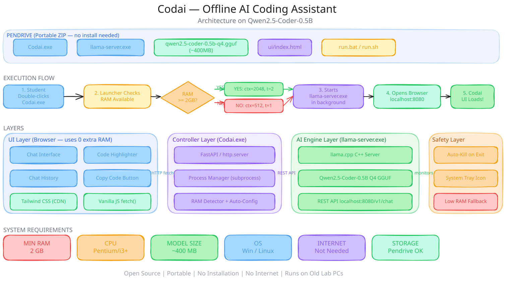

# 🚀 CodaiPro v3.0 (Codai Pro) - Offline AI Coding Assistant

<div align="center">


[](https://github.com/Luckyyaduvanshiofficial/Codai)
[](https://github.com/Luckyyaduvanshiofficial/Codai)
[](https://github.com/Luckyyaduvanshiofficial/Codai)

**🌟 A private, offline AI coding assistant that runs the official llama.cpp engine and opens in your browser**

*Built for lab exams, coding competitions, and any room where the network is off limits*

[📥 Download Latest Release](https://github.com/Luckyyaduvanshiofficial/Codai/releases/latest) • [🌐 Website](https://luckyyaduvanshiofficial.github.io/Codai/) • [📖 Model Guide](https://luckyyaduvanshiofficial.github.io/Codai/#download)

</div>

---

## What changed in v3.0

The desktop GUI is gone. CodaiPro now runs the **official `llama-server` engine** from llama.cpp with a fast **browser chat UI** — streaming answers token by token, markdown rendering, code copy buttons, a stop button, and a controller that watches the engine and restarts it if it crashes. One folder, one script, no Python GUI toolkits, no heavyweight dependencies.



## ✨ Why CodaiPro?

- **100% Offline** — inference happens on your CPU; nothing leaves the machine
- **Real llama.cpp engine** — `llama-server` with streaming, not a Python wrapper
- **Browser UI** — ChatGPT-style chat with markdown and code blocks, opened automatically
- **Self-healing** — engine health monitor, auto-restart, stale lock recovery, crash reports
- **Hardware-aware** — RAM/CPU tiers tune context size and threads automatically
- **Portable** — one folder on a USB stick; `run.bat` does everything

## 🚀 Quick Start (Windows)

```text
1. Download the portable zip from releases and unzip to a writable folder
2. Drop ONE .gguf model into the models/ folder (default: gemma-3-1b-it-Q4_K_M.gguf)
3. Double-click run.bat
4. Wait for [READY] - your browser opens http://127.0.0.1:8081/
5. Press any key in the launcher window to stop Codai safely
```

The release zip includes `Codai.exe` and the official `engine\llama-server.exe` — the only thing you add is a model.

## 🐍 Run from Source (Windows / Linux / macOS)

```bash
git clone https://github.com/Luckyyaduvanshiofficial/Codai.git
cd Codai

pip install -r requirements.txt   # just psutil

# Windows
run.bat

# Linux / macOS
python dev/controller.py
```

From source you also need the engine binary in `engine/`:

- **Windows**: `winget install llama.cpp`, then copy `llama-server.exe` into `engine\` — or grab `llama-bXXXX-bin-win-cpu-x64.zip` from [llama.cpp releases](https://github.com/ggml-org/llama.cpp/releases)
- **Linux**: download `llama-bXXXX-bin-ubuntu-x64.tar.gz` from [llama.cpp releases](https://github.com/ggml-org/llama.cpp/releases) and put `llama-server` (+ the `.so` files) into `engine/`
- **macOS**: use the llama.cpp release binaries or `brew install llama.cpp`, then symlink `llama-server` into `engine/`

## 🧠 Downloading a Model

CodaiPro runs a local GGUF model. Drop one `.gguf` file into the `models/` folder. The default expected by `config.json` is **Gemma 3 1B** — using a different file? Set `"model_name"` in `config.json` (or run `DOWNLOAD_MODEL.bat`).

**Weak lab PC? Take a tiny one — under 1 GB, runs on almost anything:**

| Model | Size | Direct download (Q4_K_M) |
|-------|------|--------------------------|
| **Gemma 3 1B Instruct** (default) | 0.81GB | [Download](https://huggingface.co/bartowski/google_gemma-3-1b-it-GGUF/resolve/main/google_gemma-3-1b-it-Q4_K_M.gguf) · [Model page](https://huggingface.co/bartowski/google_gemma-3-1b-it-GGUF) |
| **Qwen3.5-0.8B** (newest) | 0.58GB | [Download](https://huggingface.co/bartowski/Qwen_Qwen3.5-0.8B-GGUF/resolve/main/Qwen_Qwen3.5-0.8B-Q4_K_M.gguf) · [Model page](https://huggingface.co/bartowski/Qwen_Qwen3.5-0.8B-GGUF) |
| Qwen3-0.6B | 0.48GB | [Download](https://huggingface.co/bartowski/Qwen_Qwen3-0.6B-GGUF/resolve/main/Qwen_Qwen3-0.6B-Q4_K_M.gguf) · [Model page](https://huggingface.co/bartowski/Qwen_Qwen3-0.6B-GGUF) |
| Llama 3.2 1B Instruct | 0.81GB | [Download](https://huggingface.co/bartowski/Llama-3.2-1B-Instruct-GGUF/resolve/main/Llama-3.2-1B-Instruct-Q4_K_M.gguf) · [Model page](https://huggingface.co/bartowski/Llama-3.2-1B-Instruct-GGUF) |

The Qwen 3 family thinks before it answers; the engine keeps the scratchpad out of your way.

**When 2 GB is fine — a better coder:**

| Model | Size | Best For | Source |
|-------|------|----------|--------|
| **Phi-3.5-mini** ⭐ | 2.3GB | Best speed/quality balance | [microsoft/Phi-3.5-mini-instruct-gguf](https://huggingface.co/microsoft/Phi-3.5-mini-instruct-gguf) |
| **Qwen2.5-Coder-3B** | 2GB | Fast coding on low-spec machines | [Qwen/Qwen2.5-Coder-3B-Instruct-GGUF](https://huggingface.co/Qwen/Qwen2.5-Coder-3B-Instruct-GGUF) |
| **Qwen2.5-Coder-7B** | 4.7GB | Most powerful (q4_k_m) | [Qwen/Qwen2.5-Coder-7B-Instruct-GGUF](https://huggingface.co/Qwen/Qwen2.5-Coder-7B-Instruct-GGUF) |

- Pick the **q4** / **q4_k_m** quantization for the best CPU performance.
- If a model downloads as split parts, keep all parts together in `models/`.
- Chat templates are applied by the engine from the model metadata — every model above just works.

## 🏗️ Architecture

```text
CodaiPro/
├── dev/
│   ├── config.py       # config, constants, paths, env overrides
│   ├── controller.py   # orchestrator: lifecycle, logging, shutdown
│   ├── engine.py       # llama-server process + health monitor + restart
│   ├── proxy.py        # serves the UI, forwards API, streaming, telemetry
│   └── system.py       # hardware analysis (RAM/CPU tiers)
├── engine/             # llama-server binary (downloaded, not in git)
├── models/             # your .gguf model (not in git)
├── ui/                 # browser chat UI (index.html, app.js, styles.css)
├── config.json         # port, model name, debug
├── run.bat             # Windows launcher
└── kill.bat            # force-clean processes and locks
```

- **Controller** starts the proxy, boots the engine, tracks lifecycle phases, performs graceful shutdown
- **Proxy** serves `ui/` and forwards `/v1/chat/completions` to the engine with request IDs, queue control, and SSE streaming
- **Engine manager** validates the binary, waits for readiness, monitors health every 5s, auto-restarts up to 3 times
- Ports: UI `8081`, engine `8082` (from `config.json` or `CODAI_PORT`)

## ⚙️ Configuration

```json
{
  "port": 8081,
  "model_name": "gemma-3-1b-it-Q4_K_M.gguf",
  "ctx": 2048,
  "threads": 4,
  "host": "127.0.0.1",
  "debug": false,
  "log_level": "INFO"
}
```

Environment overrides: `CODAI_PORT`, `CODAI_MODEL`, `CODAI_CTX`, `CODAI_THREADS`, `CODAI_HOST`, `CODAI_DEBUG`, `CODAI_LOG_LEVEL`. Priority: environment > config.json > hardware-derived defaults.

Logs land in `logs/codai.log`, `logs/engine.log`, `logs/crash.log`. Debug mode (`"debug": true`) also exposes `/logs` and the `/telemetry` page.

## 🛠️ Technical Specifications

- **OS**: Windows 10/11 (64-bit) for the packaged release; Linux/macOS from source
- **RAM**: 4GB minimum, 8GB recommended
- **Storage**: ~1GB for the app + 0.5–5GB for one model
- **Runtime**: Python 3.10+ with `psutil` (source mode only), llama.cpp `llama-server` engine
- **UI**: your browser — no GUI toolkit, no Electron, no internet

### Key Technologies
- **Streaming chat** over SSE with stop support
- **Engine health monitor** with staged auto-restart (0s / 2s / 5s backoff)
- **Hardware-aware tuning** — context and threads scale to the machine
- **Single instance** — PID lock with stale-lock recovery
- **Rotating logs + crash reports** in `logs/`

---

## 🤝 Contributing

See [CONTRIBUTING.md](CONTRIBUTING.md) and the developer deep-dive in [docs/contributor-project-info.md](docs/contributor-project-info.md). Bug reports and model-compatibility reports are very welcome via [issues](https://github.com/Luckyyaduvanshiofficial/Codai/issues).

## 👨‍💻 About the Developer

<div align="center">

### Lucky Yaduvanshi
**Full-Stack Developer & DevOps Enthusiast**

[](https://luckyyaduvanshiofficial.github.io)
[](https://github.com/Luckyyaduvanshiofficial)

*"Building tools that make coding accessible to everyone, everywhere."*

</div>

### Why I Built CodaiPro
As a student, I experienced firsthand the frustration of lab environments without internet access. During crucial exams and projects, when you need coding assistance the most, traditional AI tools are unavailable. CodaiPro solves this by bringing powerful AI assistance directly to your machine — no internet required.

## 📄 License

Licensed under the **MIT License** — see the [LICENSE](LICENSE) file.

## 🙏 Acknowledgments

- **llama.cpp team** — for the incredible `llama-server` engine
- **bartowski & model publishers** — for the quantized GGUF models
- **Open Source Community** — for inspiration and support

## 📞 Support & Contact

- 🐛 **Bug Reports**: [GitHub Issues](https://github.com/Luckyyaduvanshiofficial/Codai/issues)
- 💬 **Discussions**: [GitHub Discussions](https://github.com/Luckyyaduvanshiofficial/Codai/discussions)
- 🌐 **Portfolio**: [luckyyaduvanshiofficial.github.io](https://luckyyaduvanshiofficial.github.io)

---

<div align="center">

### 🌟 Star this repository if CodaiPro helped you!

**Made with ❤️ for the coding community**

</div>
